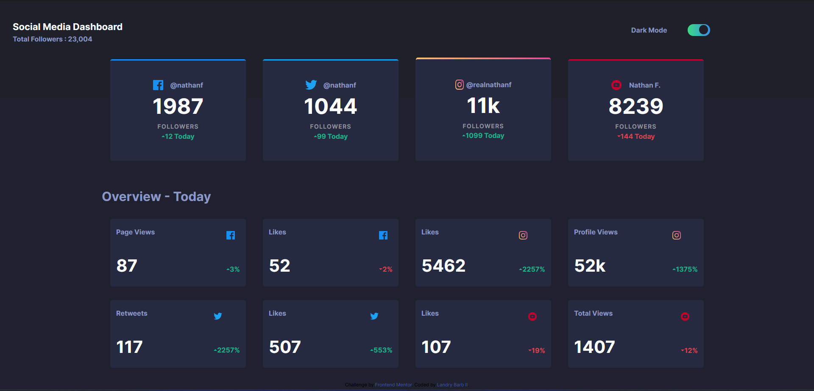
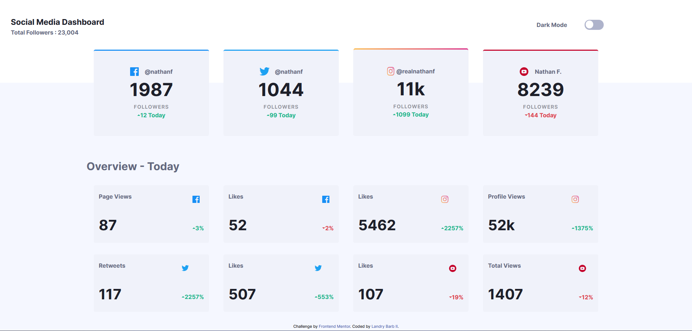

# Frontend Mentor - Social media dashboard with theme switcher solution

This is a solution to the [Social media dashboard with theme switcher challenge on Frontend Mentor](https://www.frontendmentor.io/challenges/social-media-dashboard-with-theme-switcher-6oY8ozp_H). Frontend Mentor challenges help you improve your coding skills by building realistic projects. 

## Table of contents

- [Overview](#overview)
  - [The challenge](#the-challenge)
  - [Screenshot](#screenshot)
  - [Links](#links)
- [My process](#my-process)
  - [Built with](#built-with)
  - [What I learned](#what-i-learned)
  - [Continued development](#continued-development)
  - [Useful resources](#useful-resources)
- [Author](#author)


## Overview

### The challenge

Users should be able to:

- View the optimal layout for the site depending on their device's screen size
- See hover states for all interactive elements on the page
- Toggle color theme to their preference

### Screenshot





### Links

- Solution URL: [Add solution URL here](https://your-solution-url.com)
- Live Site URL: [Add live site URL here](https://your-live-site-url.com)

## My process

### Built with

- Semantic HTML5 markup
- CSS custom properties
- Flexbox
- CSS Grid
- Mobile-first workflow
- [Blazor](https://dotnet.microsoft.com/en-us/learn/aspnet/blazor-tutorial/intro) - Learn Blazor Tutorial
- [Sass](https://www.sass-lang.com/) - Sass - Syntactically Awesome Style Sheets
- [Sass Guidelines](https://sass-guidelin.es/#architecture) - Sass Opiniated Architecture guidelines


### What I learned

Use this section to recap over some of your major learnings while working through this project. Writing these out and providing code samples of areas you want to highlight is a great way to reinforce your own knowledge.

To see how you can add code snippets, see below:

```html
<h1>Some HTML code I'm proud of</h1>
```
```css/Sass - I used a psuedo element to display the linear-gradient border on the instagram card
.card{

    &:nth-child(3) {
     position: relative;
     border: solid 1px transparent;
     background-clip: border-box;

     &:before {
         content: '';
         position: absolute;
         top: -.3rem;
         right: 0;
         bottom: 0;
         left: 0;
         z-index: $behind;
         border-radius: inherit;
         background: linear-gradient(to right,hsl(var(--instagram-1)), hsl(var(--instagram-2)));
     }
 }
}
 
```

```C# - Had to write this samll if statement to change the int property to a string to show the 11k followers
 @if (User.Followers > 9999)
  {
      <p class="total_followers ">@User.Followers.ToString().Remove(2)k</p>
  }
  else
  {
  <p class="total_followers">@User.Followers</p>
      
  }
  <p>followers</p>
```

If you want more help with writing markdown, we'd recommend checking out [The Markdown Guide](https://www.markdownguide.org/) to learn more.


### Continued development

I want to go back and make the Overview section load 'dyamically from the json file instead of having those 8 separate article elements'


### Useful resources

- [Css Tricks](https://css-tricks.com/) - This is where i got the idea to use the psuedo element for the instagram card gradient
- [Layout Land](https://www.youtube.com/watch?v=tFKrK4eAiUQ) - I watch all of Jen Simmons talks and experiments with CSS grid to inspire me with layout design


## Author

- Website - [Landry 'Blazor Bard' Barb](https://www.your-site.com)
- Frontend Mentor - [@yourusername](https://www.frontendmentor.io/profile/yourusername)
- Twitter - [@Blazor_Bard](https://twitter.com/Blazor_Bard)


